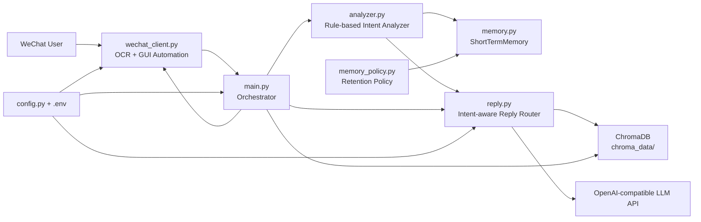
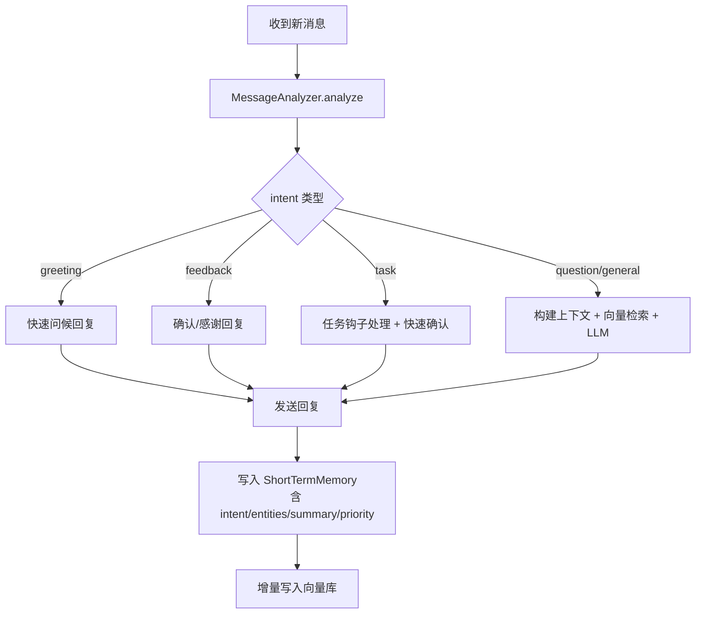

# ReplySimpleWeChat

<div align="center">


-brightgreen)


微信个人助手：**桌面自动化 + 消息分类 + 多轮记忆 + 向量检索 + LLM 回复**。

</div>

## Highlights
- 微信消息自动读取（OCR）与自动发送（GUI 自动化）
- 规则引擎消息分类（问候/问题/任务/反馈/闲聊）
- 分类型处理逻辑（例如任务类快速确认、问题类走智能检索）
- 多轮短期记忆（类型+优先级+全局裁剪）
- 向量库检索历史对话示例，增强回复风格一致性
- 单元测试覆盖核心链路（当前 `23 passed`）

---

## 架构图


## 流程图（消息处理）


---

## 项目结构
```text
.
├─ main.py                  # 主流程：收消息->分析->路由回复->发送->记忆/向量落盘
├─ analyzer.py              # 规则引擎消息分析（intent/entities/summary/priority）
├─ reply.py                 # 分类型回复路由 + 智能回复（RAG + LLM）
├─ memory.py                # 短期记忆管理（兼容旧接口，支持 analysis）
├─ memory_policy.py         # 记忆类型策略（保留轮次、sticky 等）
├─ wechat_client.py         # 微信窗口控制、OCR、消息去重
├─ config.py                # 配置加载（.env）
├─ utils.py                 # 文本清洗
├─ intent_model.py          # 预留：ML 意图分类器（sentence-transformers + LR）
├─ parse_chats.py           # 离线聊天数据解析/向量化
├─ download_model.py        # 下载 embedding 模型
├─ test_analyzer.py         # 分类与分流回复测试
├─ test_memory.py
├─ test_memory_multiturn.py
├─ test_review_fixes.py
├─ test_model.py
└─ test_send.py
```

---

## 快速开始
### 1) 环境要求
- Windows
- Python 3.10+
- 微信 PC 已登录，聊天窗口可见

### 2) 安装依赖
```bash
pip install loguru pydantic-settings openai
pip install pyautogui pygetwindow pyperclip pillow numpy easyocr
pip install chromadb sentence-transformers huggingface_hub chardet scikit-learn
```

### 3) 配置 `.env`
```env
API_KEY=your_api_key
```

### 4) 运行
```bash
python main.py
```

---

## 消息分类与处理策略
当前分类：
- `greeting`：问候（你好/hello/在吗）
- `question`：问题（问号、怎么/为什么 等）
- `task`：任务（提醒/待办/帮我/安排 等）
- `feedback`：反馈（谢谢/感谢/抱歉 等）
- `general`：其他闲聊

处理策略：
- `greeting/feedback/task`：优先走快速分流回复（低延迟）
- `question/general`：走智能回复链路（短期记忆 + 向量检索 + LLM）

---

## 与现有接口兼容性
- `memory.add_round(sender, user_msg, assistant_msg)` 旧调用仍可用
- 新增可选参数：`conversation_type`、`priority`、`analysis`
- `reply.get_smart_reply(...)` 新增可选 `analysis_context`，不传不影响旧行为

---

## 测试
运行：
```bash
python -m unittest -v
```

当前状态：
- 23 个测试通过
- 2 个测试跳过（依赖环境/手动场景）

---

## 已知限制
- 依赖微信桌面窗口位置和 OCR，分辨率/缩放变化会影响识别效果
- GUI 自动化在远程桌面/焦点被抢占场景下稳定性会下降
- 任务类目前是“钩子+日志”形式，尚未接入真实提醒服务

---

## Roadmap
- 接入真实任务调度（提醒/待办执行）
- 联系人级别策略（不同人不同回复风格）
- 更强实体识别与槽位填充
- 将 `intent_model.py` 的 ML 分类器作为可切换后端

---

## 致谢
本项目使用了：`easyocr`、`chromadb`、`sentence-transformers`、`openai` 等开源/API 生态组件。