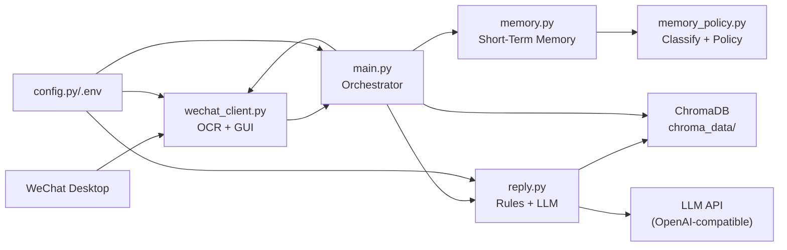
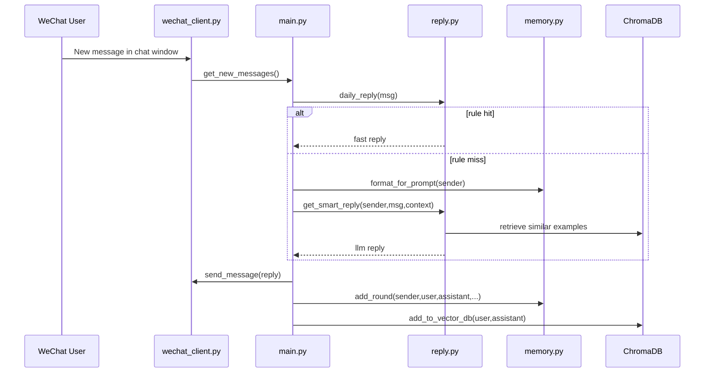

# ReplySimpleWeChat

<div align="center">


一个基于 **微信桌面自动化 + 规则分类 + 多轮短期记忆 + 向量检索 + LLM** 的个人助手。

</div>

## Highlights
- 自动读取微信新消息（OCR）
- 自动发送回复（GUI 自动化）
- 规则优先、LLM 兜底的双层回复策略
- 多轮短期记忆（按类型/优先级/粘性策略管理）
- Chroma 向量检索（历史风格参考）
- 覆盖核心逻辑的单元测试

## Architecture


## Message Flow


## Repository Structure
```text
.
├─ main.py                  # 主流程编排
├─ wechat_client.py         # 微信窗口操作、OCR、发送
├─ reply.py                 # 规则回复 + LLM 回复 + 向量检索
├─ memory.py                # 多轮短期记忆
├─ memory_policy.py         # 对话分类与记忆策略
├─ config.py                # 配置加载
├─ utils.py                 # 文本清洗
├─ parse_chats.py           # 离线历史数据解析/入库
├─ download_model.py        # 下载 embedding 模型
├─ test_*.py                # 单元测试
├─ chroma_data/             # 向量库目录
└─ model_cache/             # 本地模型目录
```

## Quick Start
### 1) Environment
- Windows
- Python 3.10+
- WeChat PC 已登录并可见窗口

### 2) Install
```bash
pip install loguru pydantic-settings openai
pip install pyautogui pygetwindow pyperclip pillow numpy easyocr
pip install chromadb sentence-transformers huggingface_hub chardet
```

### 3) Configure
在根目录创建 `.env`：
```env
API_KEY=your_api_key
```

### 4) Optional model download
```bash
python download_model.py
```

### 5) Run
```bash
python main.py
```

## Memory Strategy (Multi-turn)
- `greeting/general`: 保留较少轮
- `question`: 保留更多轮
- `schedule/task`: 更高优先级且 sticky（更不易被挤掉）
- `feedback`: 保留少量

兼容性：
- 旧调用仍可运行：`add_round(sender, user_msg, assistant_msg)`
- 新参数为可选：`conversation_type`、`priority`
- 支持类型过滤：`format_for_prompt(sender, types=[...])`

## Tests
```bash
python -m unittest -v
```

## Config Keys
- `API_KEY`
- `model_name`
- `base_url`
- `timeout`
- `max_tokens`
- `temperature`
- `reply_max_length`
- `wechat_window_width / height / x / y`

## Notes
- OCR 与窗口坐标受分辨率、缩放比例影响较大。
- 首次加载 `easyocr` 可能较慢。
- 请勿在日志或代码中输出密钥。

## Roadmap
- 联系人级别风格配置
- 可视化坐标标定工具
- 更细粒度意图分类
- 异常监控与自动恢复

---