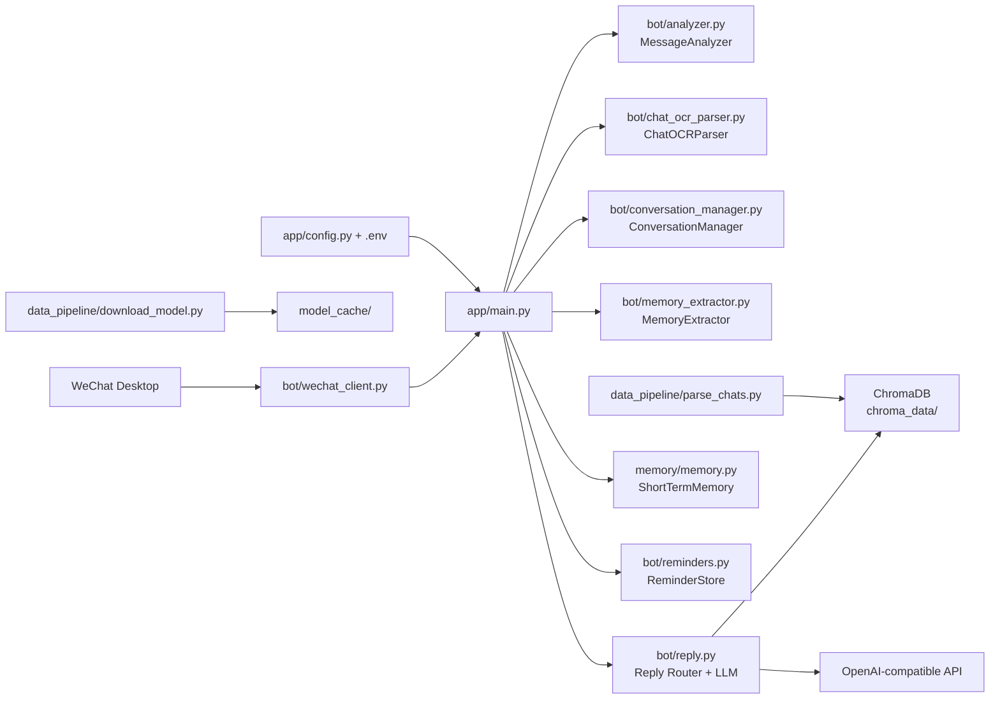
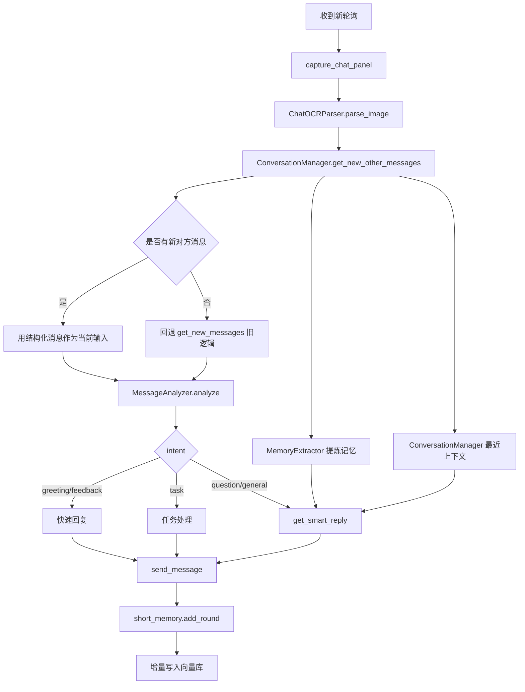

# ReplySimpleWeChat

<div align="center">


微信个人助手（桌面自动化 + 消息分析分类 + 整段聊天解析 + 结构化上下文 + 记忆提炼 + 向量检索 + 智能回复）

</div>

## 项目简介
面对微信无官方API的现状，选择桌面自动化+OCR的替代方案实现消息交互；针对窗口焦点被抢占、分辨率变化导致的自动化失效问题，设计了基于OpenCV模板匹配的窗口状态检测与自动恢复机制；为解决纯规则意图分类的泛化瓶颈，预留了轻量级BERT模型的插拔接口，并规划了基于历史对话的在线学习路径。
- 截取整段聊天区域，不再只依赖“最后一条消息”
- 将 OCR 结果结构化为消息对象（谁说的、时间、置信度、bbox、msg_id）
- 维护结构化上下文并提炼可记忆信息，辅助智能回复

## 核心能力
- 微信窗口自动化：OCR 读取消息 + GUI 自动发送
- MessageAnalyzer：支持 `rule/ml` 模式，默认 `rule`，`ml` 失败自动回退规则
- 整段聊天 OCR 解析：`ChatOCRParser` 按布局规则合并文本框并区分 `me/other/system`
- 结构化上下文管理：`ConversationManager` 去重、识别新消息、输出最近上下文
- 记忆提炼：`MemoryExtractor` 规则提炼偏好/禁忌/安排/承诺/近期话题
- 多轮记忆策略：按类型差异化保留轮次，任务类更稳（更高优先级）
- 向量检索增强：ChromaDB 检索历史对话示例，增强回复风格一致性
- 本地提醒持久化：任务写入 `tasks.json`，到点触发提醒

## 性能指标（基于100条真实对话测试）
- 自动化消息读取成功率：95%（改进前约70%）
- 意图分类准确率（规则模式）：86%
- 端到端平均响应延迟：3.2秒（其中OCR 0.4秒，LLM 2.5秒，其余为调度开销）
- OCR 业务等价准确率：70%（详细误差分析见 [troubleshooting.md](troubleshooting.md)）

## 技术选型权衡
OCR
选用 EasyOCR 因其轻量、中文支持好，且无需额外服务。相比 PaddleOCR 启动更快，但准确率稍低，通过自定义词典和归一化后处理可缓解，详见 [troubleshooting.md](troubleshooting.md)。

向量库
ChromaDB 嵌入项目方便，无需独立部署，适合个人项目。未来数据量增大时可迁移至 FAISS 或 Qdrant。

意图分类
当前规则模式快速可用，但泛化能力有限。已在 `intent_model.py` 中预留 BERT 接口，计划用历史聊天记录微调 `bert-tiny` 替换。

## 架构图


## 消息处理流程


## 当前目录结构
```text
.
├─ app/
│  ├─ config.py                  # 全局配置与路径归一化（绝对路径）
│  └─ main.py                    # 主流程入口
├─ bot/
│  ├─ analyzer.py                # 消息分析与分类（rule/ml）
│  ├─ chat_models.py             # ChatMessage / MemoryItem
│  ├─ chat_ocr_parser.py         # 整段聊天 OCR 解析
│  ├─ conversation_manager.py    # 结构化上下文管理
│  ├─ memory_extractor.py        # 可记忆内容提炼
│  ├─ intent_model.py            # ML 意图分类器封装
│  ├─ reminders.py               # 本地任务提醒持久化与到点触发
│  ├─ reply.py                   # 回复路由、向量检索、LLM 调用
│  └─ wechat_client.py           # 微信窗口自动化/OCR
├─ memory/
│  ├─ memory.py                  # ShortTermMemory
│  └─ memory_policy.py           # 记忆类型与保留策略
├─ data_pipeline/
│  ├─ parse_chats.py             # 聊天记录解析并写入向量库
│  └─ download_model.py          # 下载本地 embedding 模型
├─ utils/
│  ├─ text.py                    # 文本清洗
│  └─ mouse_pos.py               # 鼠标定位辅助
├─ tests/                        # unittest 测试集
│  ├─ test_chat_ocr_parser.py
│  ├─ test_conversation_manager.py
│  └─ test_memory_extractor.py
├─ docs/
│  ├─ README.md
│  ├─ CHANGELOG.md
│  ├─ ROADMAP.md
│  └─ troubleshooting.md
├─ chroma_data/
├─ model_cache/
├─ chat_records/
└─ tasks.json
```

## 快速开始
### 1) 环境要求
- Windows
- Python 3.10+
- 微信 PC 客户端已登录并可见目标聊天窗口

### 2) 安装依赖
```bash
pip install loguru pydantic-settings openai
pip install pyautogui pygetwindow pyperclip pillow numpy easyocr
pip install chromadb sentence-transformers huggingface_hub chardet scikit-learn
```

### 3) 配置 `.env`
在项目根目录创建或修改 `.env`：
```env
API_KEY=your_api_key
MODEL_NAME=your_model_name_if_needed
BASE_URL=https://ark.cn-beijing.volces.com/api/v3
ANALYZER_MODE=rule
```

### 4) 启动
```bash
python -m app.main
```

## 数据准备（可选）
### 下载 embedding 模型到本地
```bash
python -m data_pipeline.download_model
```

### 解析聊天记录并构建向量库
```bash
python -m data_pipeline.parse_chats
```

## 配置说明
配置文件位于 [app/config.py](../app/config.py)。
关键点：
- 所有数据路径会在启动时自动转换为项目根目录绝对路径
- `analyzer_mode` 支持 `rule` 或 `ml`
- `reminders_file` 默认 `tasks.json`

## 接口兼容说明
以下旧接口保持兼容：
- `WeChatClient.send_message(msg, chat=None)`
- `WeChatClient.get_new_messages()`
- `short_memory.add_round(sender, user_msg, assistant_msg)`
- `short_memory.format_for_prompt(sender)`
- `get_smart_reply(sender, msg, short_memory_str)`

新增能力通过可选参数接入：
- `get_smart_reply(..., structured_context=None, memory_items=None)`

## 测试
运行：
```bash
python -m unittest -v
```

当前状态（2026-03-08）：
- 33 passed
- 1 skipped（手动 GUI 集成测试）

## 已知限制
- 依赖微信窗口焦点与 OCR，分辨率/缩放变化会影响识别稳定性
- 第一版说话人判断基于布局规则，复杂场景可能误判
- 时间戳解析优先保留 `raw_timestamp`，部分格式仅做近似解析

## Roadmap
详见 [ROADMAP.md](ROADMAP.md)。

## Changelog
详见 [CHANGELOG.md](CHANGELOG.md)。
