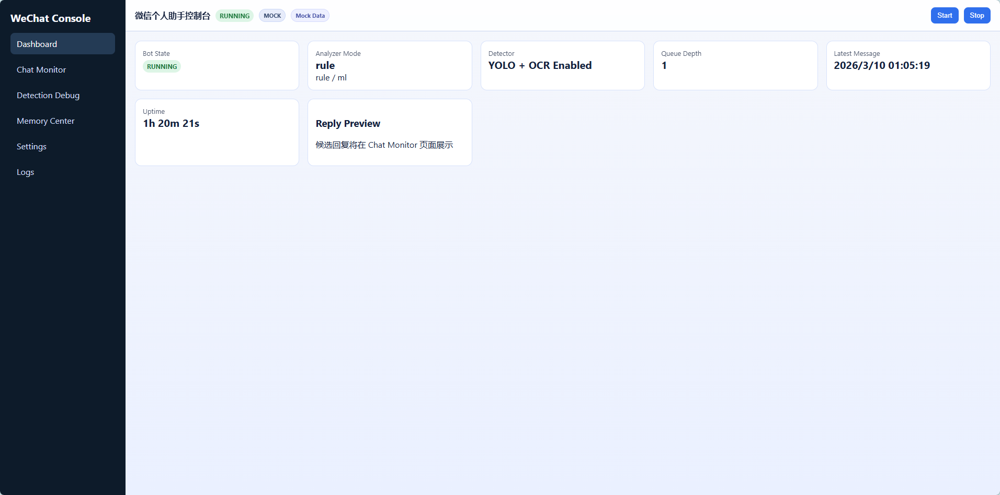
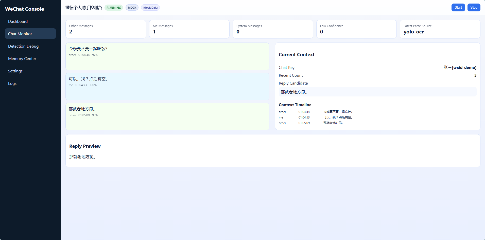
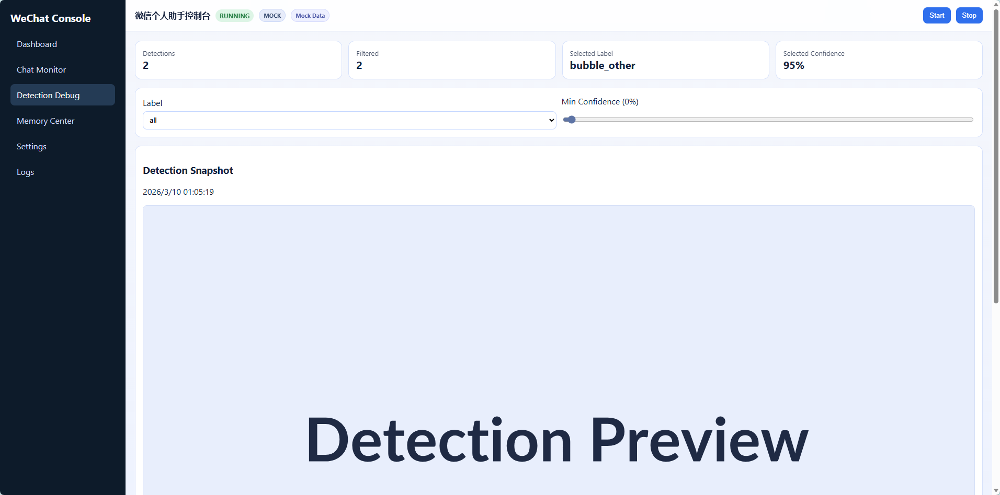
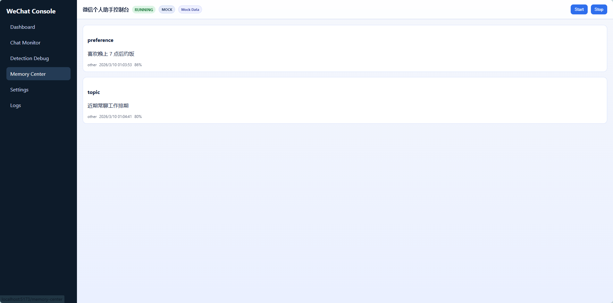
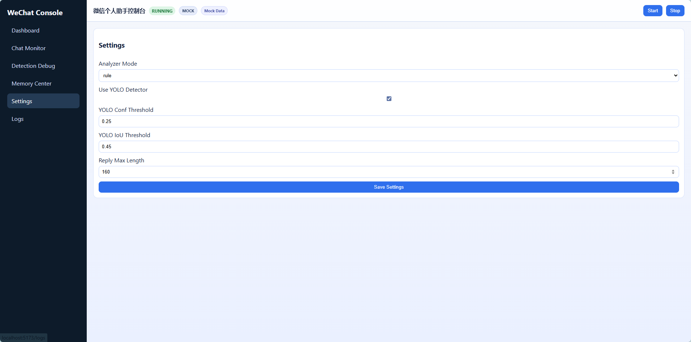

# ReplySimpleWeChat

<div align="center">


微信个人助手（桌面自动化 + 消息分析分类 + 整段聊天解析 + 结构化上下文 + 记忆提炼 + 向量检索 + 智能回复 + 控制台）

</div>

## 项目简介
面对微信无官方API的现状，选择桌面自动化+OCR的替代方案实现消息交互；针对窗口焦点被抢占、分辨率变化导致的自动化失效问题，设计了基于OpenCV模板匹配的窗口状态检测与自动恢复机制；为解决纯规则意图分类的泛化瓶颈，预留了轻量级BERT模型的插拔接口，并规划了基于历史对话的在线学习路径。
- 截取整段聊天区域，不再只依赖“最后一条消息”
- 将 OCR 结果结构化为消息对象（谁说的、时间、置信度、bbox、msg_id）
- 维护结构化上下文并提炼可记忆信息，辅助智能回复

## 核心能力
- 微信窗口自动化：OCR 读取消息 + GUI 自动发送
- MessageAnalyzer：支持 `rule/ml` 模式，默认 `rule`，`ml` 失败自动回退规则
- 整段聊天 OCR 解析：`ChatOCRParser` 按布局规则合并文本框并区分 `me/other/system`
- 结构化上下文管理：`ConversationManager` 去重、识别新消息、输出最近上下文
- 记忆提炼：`MemoryExtractor` 规则提炼偏好/禁忌/安排/承诺/近期话题
- 向量检索增强：ChromaDB 检索历史对话示例，增强回复风格一致性
- 本地提醒持久化：任务写入 `tasks.json`，到点触发提醒
- 控制台前端：`frontend/`（Vite + React + React Router + TanStack Query）
- 控制层 API：`app/control_api.py`（start/stop/status/messages/context/detections/settings/logs）

## 控制台（新增）
## 控制台预览

### Dashboard


### Chat Monitor


### Detection Debug


### Memory Center


### Settings


### Logs

- 前端目录：`frontend/`
- 页面路由：
  - `/` Dashboard
  - `/chat-monitor` Chat Monitor
  - `/detection-debug` Detection Debug
  - `/memory-center` Memory Center
  - `/settings` Settings
  - `/logs` Logs
- 环境变量：
  - `VITE_USE_MOCK=true|false`
  - `VITE_API_BASE_URL=http://127.0.0.1:8000`

## 快速运行
1. 启动控制 API：
```bash
python -m app.control_api
```
2. 启动前端：
```bash
cd frontend
npm install
npm run dev
```
3. 打开前端（默认）：`http://127.0.0.1:5173`
4. 页面点击 `Start` 启动机器人主循环（`python -m app.main`）

## 目录结构（当前）
```text
.
├─ app/
│  ├─ main.py
│  ├─ config.py
│  └─ control_api.py
├─ bot/
├─ memory/
├─ data_pipeline/
├─ utils/
├─ frontend/
│  ├─ src/pages
│  ├─ src/components
│  ├─ src/api
│  ├─ src/mocks
│  └─ src/types
├─ tests/
└─ docs/
```

## 测试
```bash
python -m unittest -v
```

## 文档
- 路线图：`docs/ROADMAP.md`
- 变更记录：`docs/CHANGELOG.md`
- 问题排查：`docs/TROUBLESHOOTING.md`