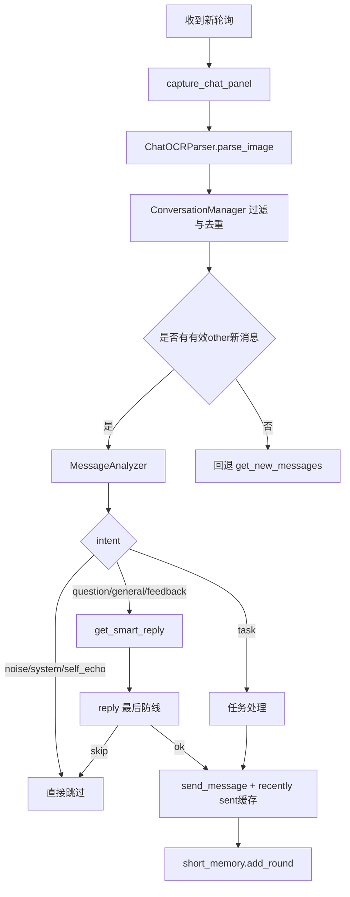

# ReplySimpleWeChat

<div align="center">


微信个人助手（桌面自动化 + 消息分析分类 + 整段聊天解析 + 结构化上下文 + 记忆提炼 + 向量检索 + 智能回复）

</div>

## 项目简介
- 截取整段聊天区域，不再只依赖“最后一条消息”
- 将 OCR 结果结构化为消息对象（谁说的、时间、置信度、bbox、msg_id）
- 维护结构化上下文并提炼可记忆信息，辅助智能回复

## 核心能力
- 微信窗口自动化：OCR 读取消息 + GUI 自动发送
- MessageAnalyzer：支持 `rule/ml` 模式，默认 `rule`，`ml` 失败自动回退规则
- 整段聊天 OCR 解析：`ChatOCRParser` 按布局规则合并文本框并区分 `me/other/system`
- 结构化上下文管理：`ConversationManager` 去重、识别新消息、输出最近上下文
- 记忆提炼：`MemoryExtractor` 规则提炼偏好/禁忌/安排/承诺/近期话题
- 向量检索增强：ChromaDB 检索历史对话示例，增强回复风格一致性
- 本地提醒持久化：任务写入 `tasks.json`，到点触发提醒

## 防乱回机制（本次补丁）
- 只放行真正来自 `other` 的新消息：`sender_role == other` 且非 `timestamp/noise/system`
- OCR 层新增标记：`is_timestamp`、`is_noise`、`raw_timestamp`、`msg_id`
- 会话层硬过滤：置信度阈值、`processed_msg_ids` 去重、两次稳定出现再确认
- self echo 防线：发送后进入最近发送缓存，OCR 命中高相似文本直接忽略
- reminder/task 隔离：内部提醒消息标记 `internal_reminder`，不进入普通回复链
- analyzer 防误判：新增 `noise/system/self_echo` 意图，垃圾输入降置信度
- reply 最后一层兜底：命中 `noise/system/self_echo/短碎片` 直接跳过回复

## 性能指标（基于100条真实对话测试）
- 自动化消息读取成功率：95%（改进前约70%）
- 意图分类准确率（规则模式）：86%
- 端到端平均响应延迟：3.2秒（其中OCR 0.4秒，LLM 2.5秒，其余为调度开销）
- OCR 业务等价准确率：70%（详细误差分析见 [troubleshooting.md](troubleshooting.md)）

## 技术选型权衡
OCR
选用 EasyOCR 因其轻量、中文支持好，且无需额外服务。相比 PaddleOCR 启动更快，但准确率稍低，通过自定义词典和归一化后处理可缓解，详见 [troubleshooting.md](troubleshooting.md)。

向量库
ChromaDB 嵌入项目方便，无需独立部署，适合个人项目。未来数据量增大时可迁移至 FAISS 或 Qdrant。

意图分类
当前规则模式快速可用，但泛化能力有限。已在 `intent_model.py` 中预留 BERT 接口，计划用历史聊天记录微调 `bert-tiny` 替换。

## 消息处理链路


## 当前目录结构
```text
.
├─ app/main.py
├─ bot/
│  ├─ analyzer.py
│  ├─ chat_models.py
│  ├─ chat_ocr_parser.py
│  ├─ conversation_manager.py
│  ├─ memory_extractor.py
│  ├─ reminders.py
│  ├─ reply.py
│  └─ wechat_client.py
├─ memory/
├─ data_pipeline/
├─ utils/
├─ tests/
│  ├─ test_chat_ocr_parser.py
│  ├─ test_conversation_manager.py
│  ├─ test_self_echo.py
│  ├─ test_reminder_isolation.py
│  └─ test_analyzer_noise_guard.py
└─ docs/
```

## 接口兼容说明
以下旧接口保持兼容：
- `WeChatClient.send_message(msg, chat=None)`
- `WeChatClient.get_new_messages()`
- `short_memory.add_round(sender, user_msg, assistant_msg)`
- `short_memory.format_for_prompt(sender)`
- `get_smart_reply(sender, msg, short_memory_str)`

新增能力通过可选参数接入：
- `get_smart_reply(..., structured_context=None, memory_items=None, message_meta=None, recently_sent_match=False)`

## 测试
运行：
```bash
python -m unittest -v
```

当前状态（2026-03-08）：
- 42 passed
- 1 skipped（手动 GUI 集成测试）

重点回归用例：
- `tests/test_chat_ocr_parser.py`
- `tests/test_conversation_manager.py`
- `tests/test_self_echo.py`
- `tests/test_reminder_isolation.py`
- `tests/test_analyzer_noise_guard.py`

## Roadmap
详见 [ROADMAP.md](ROADMAP.md)。

## Changelog
详见 [CHANGELOG.md](CHANGELOG.md)。
