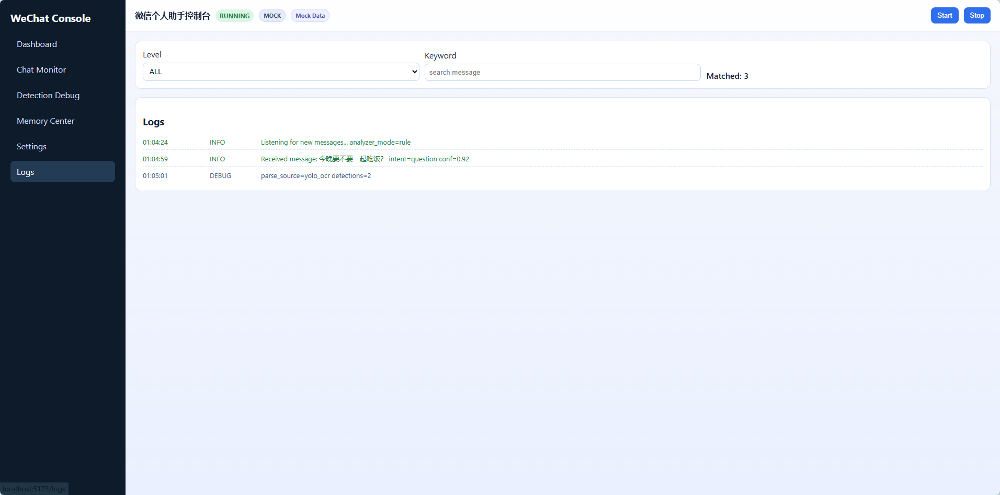

# TROUBLESHOOTING

## 2026-03-10

### 1. 前端访问 `127.0.0.1` 报错 `ERR_CONNECTION_REFUSED`
现象：
- 浏览器显示“无法访问此页面 / 127.0.0.1 拒绝连接”。

原因：
- 打开了 `http://127.0.0.1`（默认 80 端口），但服务实际运行在 `8000`（后端）或 `5173`（前端）。

处理：
- 后端检查：打开 `http://127.0.0.1:8000/api/status`。
- 前端检查：运行 `npm run dev` 后访问终端打印的地址（通常 `http://127.0.0.1:5173`）。

---

### 2. `npm run dev` 报错：`Unexpected token '' ... is not valid JSON`
现象：
- Vite 启动失败，提示 PostCSS 配置读取失败；堆栈中出现 `Unexpected token ''`。

原因：
- `frontend/package.json` 或其他配置文件含 UTF-8 BOM，导致 JSON 解析失败。

处理：
- 将相关文件转为 UTF-8 无 BOM（`package.json`、`tsconfig.json`、`vite.config.ts`、`.env` 等）。
- 重新执行 `npm run dev`。

---

### 3. 前端显示 `REAL + Disconnected`
现象：
- Topbar 显示 REAL，但 API 连通状态为 Disconnected。

原因：
- 控制 API 未启动，或 `VITE_API_BASE_URL` 配置错误。

处理：
1. 确认后端运行：
```bash
python -m app.control_api
```
2. 确认前端环境变量：
```env
VITE_USE_MOCK=false
VITE_API_BASE_URL=http://127.0.0.1:8000
```
3. 重启前端 dev server。

---

### 4. 点击 Start 无反应
现象：
- 页面点击 Start 后状态不变。

排查：
- 先看 `http://127.0.0.1:8000/api/status` 是否可访问。
- 再看控制 API 控制台是否有异常输出。
- 检查本机是否能直接运行：
```bash
python -m app.main
```

说明：
- 当前控制层通过子进程启动 `app.main`，依赖本机 Python 运行环境正常。

---

### 5. 仍想先本地演示，不联后端
处理：
- 在 `frontend/.env` 中设置：
```env
VITE_USE_MOCK=true
```
- 页面可完整演示，不依赖控制 API。

## 历史问题
- OCR 误触发、self echo、向量库路径等历史问题已在前序版本修复。
- 详见 `docs/CHANGELOG.md` 与单测用例。
## 联调成功示例截图

当控制 API 与前端都正常时，可参考：

